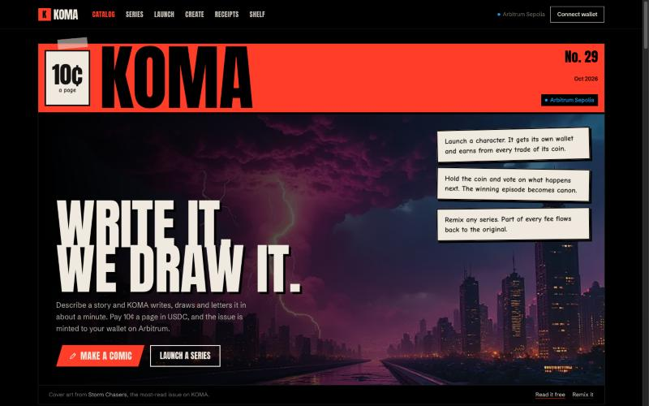
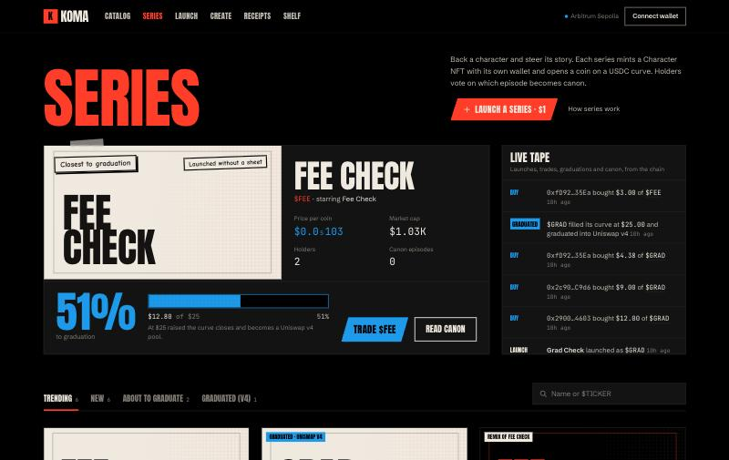
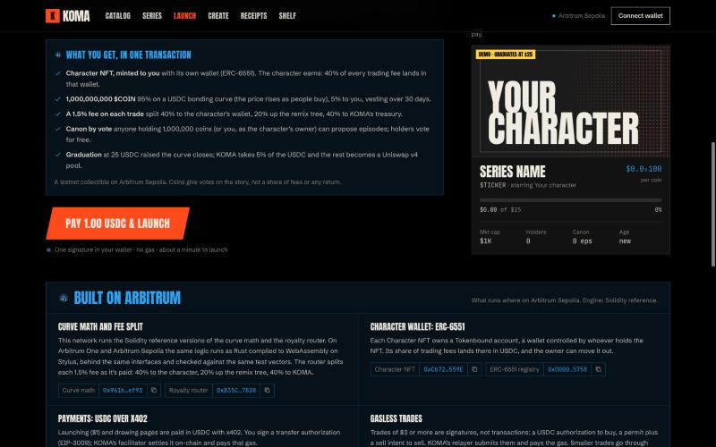

# KOMA

[](https://github.com/nickthelegend/koma/actions/workflows/ci.yml)

**AI comics you own, and characters fans write — on Arbitrum.**

Describe a story and KOMA writes, draws and letters it in about a minute. You pay 10¢ a page in USDC with one signature (x402, no gas) and the issue is minted to you. Then launch its hero as a **series**: a Character NFT with its own wallet, a coin on a USDC bonding curve whose math runs in **Arbitrum Stylus**, and a canon that holders vote on.

[Live demo](https://koma-arbitrum.vercel.app) · [How it works](https://koma-arbitrum.vercel.app/how) · [Test plan & results](docs/TEST_PLAN.md) · [Security audit](contracts/AUDIT.md) · [Mainnet runbook](deploy/MAINNET.md)



| The series launchpad | Built on Arbitrum, with real addresses |
|---|---|
|  |  |

## What you can do

- **Make a comic.** Chat with an AI editor (or use the form), agree a pitch, sign once. A script, 4 panels a page and live lettering are generated by fal (Claude via `openrouter/router`, FLUX.2) and minted to you as a `KomaIssues` ERC-721 that commits to the exact pages. Reading is free; remixes link back to the original.
- **Launch a series ($1).** KOMA draws a character sheet and, in one transaction, mints a Character NFT with an ERC-6551 wallet, a Series Coin (1B supply: 95% on the curve, 5% vesting to you over 30 days) and its USDC bonding curve.
- **Trade with no gas.** Buys are one USDC signature; sells are a permit plus a signed intent. KOMA's relayer submits them (from $3), and the signatures fix the amount, minimum out and deadline so the relayer can't change them.
- **Write the canon.** Hold 1M coins (or own the character) to propose the next episode, drawn with the character sheet so the hero stays on model. Holders vote for free with an EIP-712 signature at a snapshot; the keeper finalizes the winner on chain with a root of every published vote.
- **Earn as a character.** 40% of every trading fee lands in the character's own wallet, which its owner can withdraw from the series page. Remixes pay up the tree.
- **Graduate.** When a curve hits its target it closes into a locked Uniswap v4 pool (KOMA's Graduator is the pool's hook, so nobody can squat it), and trading continues there.

## Built on Arbitrum

| Piece | What runs |
|---|---|
| **Stylus (Rust → WASM)** | `stylus/curve-math` (bonding-curve quotes) and `stylus/royalty-router` (the fee split and remix tree). The Solidity curve calls them through `ICurveMath` / `IRoyaltyRouter`; Solidity reference implementations are differential-tested against them on a Nitro devnode (10,192/10,192 outputs, byte-identical reverts). |
| **x402 on USDC** | Every paid action is an HTTP 402 → one EIP-3009 signature → settled by KOMA's own Arbitrum facilitator (`/api/facilitator/*`, usable by any app or agent). |
| **ERC-6551** | Each Character NFT owns a Tokenbound AccountV3 that receives its fees. |
| **Uniswap v4** | Graduation seeds a full-range pool and burns the position; KomaSwapper trades through it. |
| **Gasless relayer** | EIP-3009 / EIP-2612 / EIP-712 intents submitted by KOMA; optional ERC-7677 sponsorship via Pimlico for wallet-sent trades. |
| **Alchemy (node provider)** | The server's Arbitrum Sepolia RPC (`KOMA_SERVER_RPC_URL`): relayer, keeper, facilitator settlement, quotes and indexer reads, plus Foundry deploys (`--rpc-url arbitrum_sepolia`), fork tests, Stylus activation and the local fork's upstream. Log scans can use a separate `KOMA_LOGS_RPC_URL` (Alchemy's free tier caps `eth_getLogs` at 10 blocks). The key stays server-side. |

Measured, not assumed (`stylus/bench/results.json`): the cached Stylus router is slightly cheaper than Solidity for a 3-level remix split (131,802 vs 132,890 gas); for tiny pure math calls Stylus's per-call entry cost makes it more expensive (25,992 vs 22,940 gas per cached `quoteBuy`). Mainnet deploys cache both programs (Arbitrum's Stylus CacheManager).

## How KOMA makes money

Every action pays for itself except the 10¢ comic page, which is the hook. Costs are measured — fal from the spend log, gas from real receipts — and priced for Arbitrum One (0.02 gwei, ETH $2,680, +30% L1 data).

| Action | Cost to KOMA | Price | Margin |
|---|---|---|---|
| Comic, 1 page (incl. chat) | $0.109 | $0.10 | ≈ break-even |
| Comic, 2 / 4 pages | $0.157 / $0.253 | $0.20 / $0.40 | +22% / +37% |
| Series episode, 1 page (character-sheet references) | $0.161 | $0.30 | +46% |
| Launch a series | $0.37 | $1.00 | +63% |
| Relayed trade | ~$0.021 gas | 0.6% of the trade (KOMA's 40% of the 1.5% fee) | positive from ~$3.50; relay floor $3 |
| Graduation | ~$0.06 gas | 5% of the USDC raised | $250 on a $5,000 curve |

Guards: a daily fal budget (`KOMA_FAL_DAILY_USD`), per-visitor and global chat limits, and no quotes at all while fal is unavailable — so nobody pays for work that can't be drawn.

## Architecture

```
Browser (wagmi/viem) ─┬─ HTTP 402 → sign → /api/comics | /api/series      (x402, KOMA facilitator settles USDC)
                      ├─ signed intents → /api/trade/relay                  (gasless curve / pool trades)
                      └─ signed votes   → /api/canon/:id/vote               (free, weighted at snapshot)
Next.js server ─┬─ fal: openrouter/router (script, chat) · FLUX.2 (sheets, panels) · flux-2/edit (episodes)
                ├─ relayer + keeper: launches, proposals, canon finalization, graduations
                ├─ indexer → SQLite (series, trades, holders, royalties, canon)   art on disk
                └─ RPC → Arbitrum
Contracts ─ SeriesFactory ─┬─ CharacterNFT ── ERC-6551 account (earns fees)
                           ├─ SeriesCoin (ERC20 + Permit + Votes) ── VestingWallet (5%)
                           └─ BondingCurve ─┬─ ICurveMath (Stylus)
                                            ├─ IRoyaltyRouter (Stylus) → character / ancestors / treasury
                                            └─ Graduator (v4 hook) → Uniswap v4 → KomaSwapper
            CanonRegistry · KomaIssues (ERC-721 issues tied to their x402 payment)
```

## Run it locally (no real money)

Needs Node 22+, Foundry, Rust (for Stylus) and a fal.ai key. The local chain is a pinned, persisted fork of Arbitrum Sepolia running the real Circle USDC, Tokenbound and Uniswap v4 contracts.

1. `cp .env.example .env.local` and fill in `FAL_KEY`, `NEXT_PUBLIC_ARBITRUM_RPC_URL=http://127.0.0.1:18611`, `KOMA_FORK_BLOCK=<recent Arbitrum Sepolia block>`, fresh keys (`cast wallet new`) for `SERVER_*` and the `TEST_*` wallets, and `KOMA_PAY_TO`. Don't use the public anvil accounts (they carry EIP-7702 delegations on Arbitrum Sepolia and USDC rejects their signatures).
2. `npm run chain` (keep it running; it mines a block a second like a real chain).
3. `sh scripts/local-setup.sh` deploys `KomaIssues` and funds the test wallets; deploy the launchpad with `contracts/script/DeployLaunchpad.s.sol` (see `deploy/MAINNET.md` §3 for the flags; locally add `ALLOW_EOA_ADMIN=true ADDRESSES_OUT=../.data/addresses.local.json`) and set `KOMA_LAUNCHPAD_ADDRESSES=.data/addresses.local.json`.
4. `npm run dev` → http://localhost:4310.

Agents can buy a comic over HTTP 402 from the command line:

```bash
BUYER_KEY=$(grep ^TEST_AGENT_KEY= .env.local | cut -d= -f2) npm run buy -- "a vending machine that grants wishes, only to cats" 1 pop-art Comedy
```

## Deployments

| Network | Status | Addresses |
|---|---|---|
| KOMA hosted localnet (chain 4216141, behind the live demo) | Live | `deploy/addresses.4216141.json` · KomaIssues `0xB2b1A0E0c4692B792e5E7Db6443EEc0A77658396` |
| **Arbitrum Sepolia (421614)** | **Live, Stylus engine**, sources verified on Sourcify (exact match); pilot series #1 launched on chain | [`deploy/addresses.421614.json`](deploy/addresses.421614.json) · Stylus curve math [`0xc4bf…30e9`](https://sepolia.arbiscan.io/address/0xc4bf7e0587a229ebea208d6d2f15b15faee730e9) · Stylus royalty router [`0x6584…adae`](https://sepolia.arbiscan.io/address/0x658410eddf0eefaf97837d1e47e78693b87fadae) · SeriesFactory [`0x9195…8728`](https://sepolia.arbiscan.io/address/0x91956C4C739619b2F5bb5835E23E928a215a8728) · KomaIssues [`0xB23E…0fE3`](https://sepolia.arbiscan.io/address/0xB23E24865d0F6C32af980E8b0af87384A4020fE3) |
| Arbitrum One (42161) | Prepared, not deployed: runbook, guarded deploy script, preflight, measured cost ≈ 0.00067 ETH | `deploy/MAINNET.md`, `deploy/mainnet-cost.json` |

The live demo runs on the hosted localnet (a persistent Arbitrum Sepolia fork with its own chain id, a filtered public RPC at `/api/rpc` and a 1-test-USDC faucet). It currently serves the build before the 2026-10-01 audit; local is the latest.

## API

| Route | What it does |
|---|---|
| `POST /api/comics` (+ `/quote`) | `{ prompt, pages: 1\|2\|4\|6, style?, genre?, cast?, custom?, remixOf?, seriesId? }` → 402 quote (10¢/page; 30¢ for a series episode), then 202 `{ jobId }`. |
| `GET /api/jobs/:id` | `settling → writing → drawing → lettering → minting → done` (or `error` with `failedAt`). |
| `POST /api/chat` | The AI editor: `{ messages, pitch? }` → `{ reply, pitch }`. |
| `GET /api/comics`, `/api/tokens/:id`, `/api/art/:issue/:file` | Issues, ERC-721 metadata, art. |
| `POST /api/series` (+ `/quote`) | Launch: `{ name, symbol, characterName, characterPrompt, pitch, genre?, parentSeriesId? }` → 402 ($1) → poll `/api/launches/:id`. |
| `GET /api/series`, `/api/series/:id` | Indexed series: price, market cap, raised/target, holders, trades, chart, royalties, remixes, pool. |
| `POST /api/trade/relay` | Gasless `buy`, `sell` or post-graduation `swap-buy` intent → tx hash. |
| `GET /api/canon/:id`, `POST /api/canon/:id/vote` | Open episode, proposals and tallies, canon so far, every signed vote / cast a vote. |
| `GET /api/characters/:id` | Character NFT metadata. |
| `POST /api/paymaster` | ERC-7677 proxy to Pimlico (needs `PIMLICO_API_KEY`). |
| `/api/facilitator/{supported,verify,settle}` | KOMA's x402 facilitator for Arbitrum. |
| `GET /api/status` | Chain, readiness, launchpad addresses and engine, relayer balance, fal availability, daily spend. |

Styles: `neon-anime`, `pop-art`, `noir`, `superhero`, `gothic`, `retro-sf`; ready-made cast in `src/lib/studio-config.ts`.

## Tests

```bash
npm run contracts:test        # 159 Solidity unit + fuzz tests, on real Circle USDC and Tokenbound bytecode
npm run contracts:test:fork   # 5 fork tests against Arbitrum Sepolia (USDC, Tokenbound, Uniswap v4, withdrawals, Safe admin)
npm run stylus:test           # 36 Rust tests; stylus/integration/run.sh for the Nitro devnode differential run
npm run test:api              # x402 + issues API against the running server
npm run test:launchpad        # launch → trades → propose → vote → canon → royalties → graduation (needs fal)
npm run check:economics       # on-chain fee/royalty/graduation/pool checks on the local fork (no fal needed)
npm run preflight:mainnet     # read-only readiness checks for a deployment
npm run typecheck && npm run lint
```

[`docs/TEST_PLAN.md`](docs/TEST_PLAN.md) defines every component and flow, what "correct" means for each, and the results of every run.

## Security

[`contracts/AUDIT.md`](contracts/AUDIT.md) is a full pre-mainnet review (1 High, 3 Medium, 4 Low fixed or mitigated, with tests). The trading fee is a compile-time constant (1.5%), the treasury is set once, character earnings can only be moved by the NFT owner, and the mainnet deploy refuses EOA admins and hands every admin role to a Safe. It's a single-reviewer audit: get an independent one before meaningful money is at stake.

## Repository

```
src/            Next.js app: pages, API routes, studio, launchpad UI, server (x402, pipeline, relayer, indexer)
contracts/      Foundry: KomaIssues + launchpad contracts, unit/fuzz/fork tests, deploy scripts, AUDIT.md, LAUNCHPAD_SPEC.md
stylus/         Arbitrum Stylus crates (curve-math, royalty-router), test vectors, devnode integration, gas bench
scripts/        local chain, e2e harnesses, economics check, mainnet preflight, Stylus deploy
deploy/         per-chain addresses, mainnet runbook and cost, env template, Vercel proxy
docs/           test plan, original plan, launch (GTM) drafts, screenshots
```

## Known limits

- If generation fails for good after a payment settles, the job ends in `error` with the payment shown; there are no automatic refunds yet.
- SQLite and on-disk art mean one server instance (mount `KOMA_DATA_DIR` on a persistent volume); the pipeline runs in-process, so use a long-running Node host.
- Canon tallies are computed by KOMA's relayer from signed votes and committed on chain with a votes root; anyone can recheck them from the published list, but signature verification on chain is future work.
- No pause and no upgrades by design: a contract bug means deploying a new factory.
