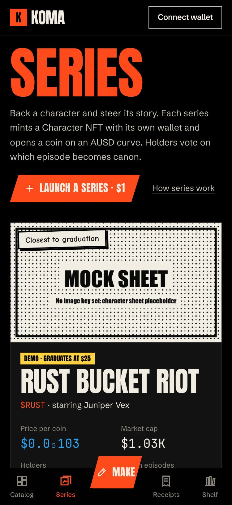
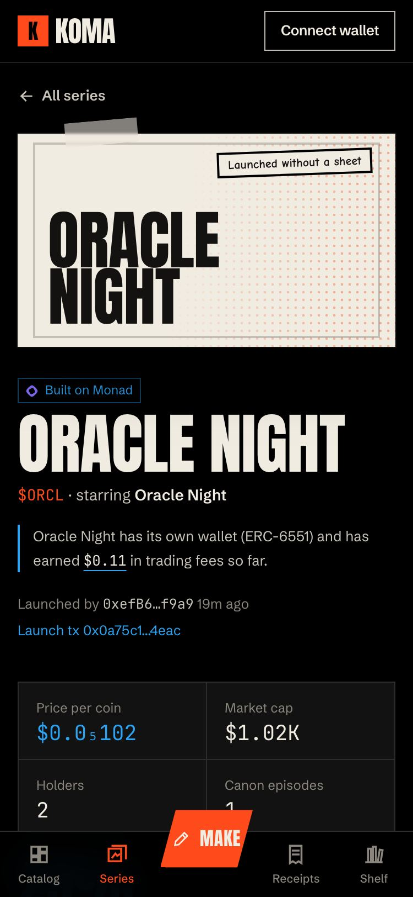
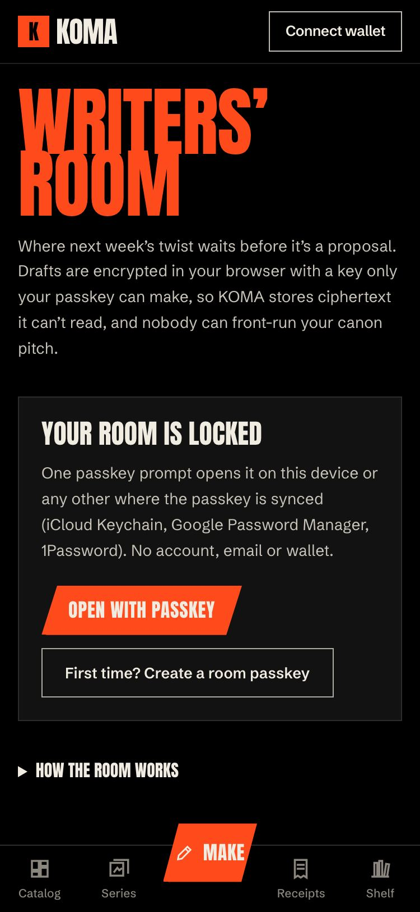
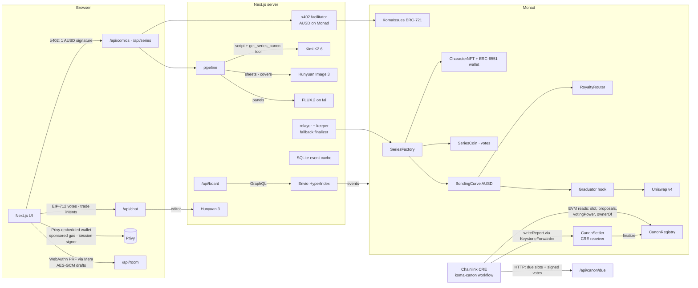

# KOMA on Monad

[](https://github.com/nickthelegend/koma-monad/actions/workflows/ci.yml)

**Comics fans own, and characters whose stories their holders write.**

Describe a story and KOMA's AI editor (Tencent **Hunyuan 3**) shapes it into a pitch; **Kimi K2.6** writes the
script and fal draws it (character sheets and covers by **Hunyuan Image 3**). You pay a few cents of **AUSD** on
**Monad** with one signature (x402, no gas) and the issue is minted to you. Launch its hero as a **series**: a
Character NFT with its own wallet, a coin on an AUSD bonding curve, and a canon that holders vote on. Each
episode's script reads the voted canon first (a Kimi tool call). The votes are settled on chain by a
**Chainlink CRE** workflow, the board's leaderboard is indexed by **Envio**, the account layer is **Privy**, and
unpublished twists sit in a **Mera** passkey-encrypted Writers' Room.

Monad Metropolis · Track 3 (Social, Attention & Culture) · [Submission](SUBMISSION.md) ·
[Sponsor status](docs/SPONSOR-GAP.md) · [Go-live runbook](docs/DEPLOY-LATER.md) · [Security review](contracts/AUDIT.md) · MIT

| Series board (phone) | A series: coin, canon, autopilot | Writers' Room |
|---|---|---|
|  |  |  |

## Run it locally (one command, no real money)

```bash
npm install
echo "FAL_KEY=<your fal key>" >> .env.local     # optional: real Kimi, Hunyuan and art through fal
npm run demo                                     # → http://localhost:4320   (npm run demo:stop to stop)
```

`npm run demo` forks Monad testnet with anvil (real AUSD, Tokenbound, Permit2), creates fresh local-only keys,
deploys everything with the real deploy scripts (the launchpad, Uniswap v4, which Monad testnet lacks, and the CRE
canon settler), funds the test wallets with Agora's real AUSD, starts the Envio indexer (if Docker and Node 22 are
present), then builds and serves the app. Needs Node ≥ 22.13, Foundry and Bun; Docker for Envio. Without AI keys the
studio says it isn't configured; everything else works.

## What you can do

- **Make a comic.** Chat with the Hunyuan editor (or use the form), agree a pitch, sign once. Kimi writes the
  script; FLUX.2 draws the panels; the issue is minted as an ERC-721 that commits to the exact pages, and its page
  credits the models that made it. If a model gives up after you've paid, **Try again** resumes it with no second
  charge.
- **Launch a series ($1).** Hunyuan Image 3 draws a character sheet. One transaction then mints the Character NFT
  with an ERC-6551 wallet, a 1B-supply Series Coin (5% vesting to you) and its AUSD bonding curve.
- **Trade without gas.** A buy is one AUSD signature (EIP-3009); a sell is a permit plus a signed intent. KOMA's
  relayer submits them from $3 up. With a Privy embedded wallet, even wallet-sent transactions are gas-sponsored.
- **Write the canon.** Holders (≥1M coins, or the character's owner) propose the next episode, drawn on-model
  from the character sheet. Its script is Kimi's, after a `get_series_canon` tool call. Holders vote for free with
  an EIP-712 signature weighted at a snapshot. A **Chainlink CRE** workflow re-verifies every signature and weight
  on Monad and settles the winner on chain.
- **Let the autopilot back you** (Privy session signer). KOMA votes for you each round and buys a fixed amount when
  an episode becomes canon, inside a policy Privy enforces: canon votes on this series only, AUSD only to this
  curve, capped per buy.
- **Earn as a character.** 40% of every 1.5% trading fee lands in the character's own wallet, and remixes pay up
  the tree. At its target the curve graduates into a locked Uniswap v4 pool.
- **Keep secrets in the Writers' Room** (`/room`). One passkey prompt derives keys that are not a wallet: drafts are
  encrypted in the browser, and the server stores ciphertext under an id that isn't linked to you.
- **See who's winning.** The `/series` leaderboard (volume, top series, top backers) comes from the Envio indexer.

## Why Monad

- **Every vote, trade and payment is a transaction somebody waits on.** Sub-second blocks make a gasless buy feel
  like a button press, and an x402 payment settle before the studio's spinner starts.
- **Gas cheap enough to relay.** KOMA pays the gas for every trade from $3 and for every settlement. On Monad the
  relayer's margin stays positive at small sizes.
- **A dollar on chain.** Agora's AUSD (EIP-3009 and permit) is native here, so payments, curves and pools are in
  dollars with no bridging.
- **The ecosystem is all on one chain:** CRE (`monad-testnet` is a supported chain), Envio HyperSync (a native
  HyperSync chain), Privy's gas sponsorship (Monad supported), and Tokenbound and Permit2 at their canonical addresses.
- **Monad-specific engineering.** Gas limits are sized from estimates, because Monad bills the limit. Log scans
  respect the public RPC's 100-block `eth_getLogs` cap. Uniswap v4, which isn't on testnet, is deployed by the
  deploy script itself.

## Architecture



## Sponsors

| | How KOMA uses it | Where |
|---|---|---|
| **Tencent Hunyuan** | Hunyuan 3 is the studio's interactive editor; Hunyuan Image 3 draws every character sheet and the covers | `src/lib/server/{providers,chat,ai}.ts` |
| **Kimi** | Kimi K2.6 writes every script; for an episode it calls `get_series_canon` and continues the voted canon | `src/lib/server/ai.ts` (`writeScript`, `CANON_TOOL`) |
| **Privy** | Embedded wallets, gas sponsorship, and a session signer + policy for the backer autopilot | `src/components/wallet.tsx`, `src/lib/server/autopilot/` |
| **Envio** | A HyperIndex indexer with aggregated entities (series, backers, daily volume, canon, stats) that feeds the leaderboard | `indexer/`, `src/lib/server/launchpad/board.ts` |
| **Chainlink CRE** | A workflow that re-verifies and settles canon votes, plus a `ReceiverTemplate` receiver holding the registry's relayer role | `cre/koma-canon/`, `contracts/src/cre/CanonSettler.sol` |
| **Mera** | One Passkey, Many Keys: the Writers' Room, with PRF → HKDF → an Ed25519 room identity and an AES-GCM drafts key | `src/lib/room/`, `src/app/room/` |
| **Agora AUSD** | The currency of every payment, curve, pool and fee; the faucet in the app | `src/lib/network.ts`, `src/app/api/faucet/` |

What each one still needs to run live (keys, logins, the testnet go) is in [docs/SPONSOR-GAP.md](docs/SPONSOR-GAP.md).

## Tests

```bash
cd contracts && forge test                        # 168 unit + fuzz (Solidity), incl. CanonSettler
cd contracts && FORK_TESTS=1 forge test --match-path 'test/fork/*'   # 5 against live Monad testnet state (read-only)
cd cre/koma-canon && bun test                     # 8: the CRE workflow through the SDK's test runtime
npm run test:unit                                 # autopilot policy, prompt softener
npm run test:api        # x402 + issues API (real models)           npm run test:launchpad  # launch → trade → canon → graduate
npm run test:browser    # the main flows through the UI, real wallet signatures      npm run test:walk  # every page at 375 px
npm run test:cre        # CRE settlement on the fork                 npm run test:envio      # indexer parity + live data
npm run test:room       # Writers' Room (passkey PRF)                 npm run test:ai         # real Kimi / Hunyuan, credits
node scripts/check-economics.mjs                  # fees, royalties, graduation, pool on chain
```

The latest full run is in [SUBMISSION.md → Evidence](SUBMISSION.md#evidence).

## Built in the Metropolis window, and what came before

- **Pre-existing base (29 Sep – 4 Oct 2026):** KOMA was first built for Arbitrum, for another hackathon. That build
  covered the comic pipeline, x402 payments, the launchpad contracts and the original UI. Its docs are kept
  unchanged in `docs/base-arbitrum/`.
- **New for Monad (5 – 6 Oct 2026, inside the 1 Sep – 13 Oct window):**
  - the port to Monad: AUSD everywhere, a Monad testnet/mainnet address book, a deploy script that deploys
    Uniswap v4 where it's missing, and a Monad testnet fork harness and CI;
  - the AI layer on Kimi and Hunyuan, with tool calling and model credits;
  - Privy embedded wallets, gas sponsorship and the session-signer autopilot;
  - the Envio indexer and the leaderboard;
  - the Chainlink CRE workflow and `CanonSettler`;
  - the Mera Writers' Room;
  - the paid-job retry, the browser, walk, CRE, Envio and room e2e suites, and these docs.

  `git log` starts at the port.

## AI tools disclosure

**Claude Code** (Anthropic) wrote most of the code, tests and docs, under the author's direction and review. At
runtime KOMA uses **Kimi K2.6** (scripts), **Hunyuan 3** (editor), **Hunyuan Image 3** and **FLUX.2** (art).

## Repository

```
src/          Next.js app: pages, API routes, studio, launchpad UI, Writers' Room; server: x402, pipeline, relayer, keeper, indexer
contracts/    Foundry: KomaIssues, launchpad, CanonSettler (CRE receiver); unit/fuzz/fork tests; deploy scripts; AUDIT.md
cre/          Chainlink CRE project: koma-canon workflow, tests, configs, fork harness
indexer/      Envio HyperIndex: config, schema, handlers, isolated Postgres/Hasura compose
scripts/      demo, local chain + setup, e2e suites, wallet shim, economics check
docs/         SPONSOR-GAP, DEPLOY-LATER, TEST-PLAN-ZERO-MOCK, screenshots; base-arbitrum/ (the pre-existing build's docs)
```

## Known limits

- Not deployed to Monad testnet yet (by instruction); see the runbook.
- SQLite and on-disk art mean one server instance on a persistent volume, with the pipeline in-process.
- The CRE workflow trusts KOMA's server only to *list* the votes. A withheld vote is detectable from the published
  votes root, but not prevented.
- No pause and no upgrades, by design: a contract bug means deploying a new factory.
